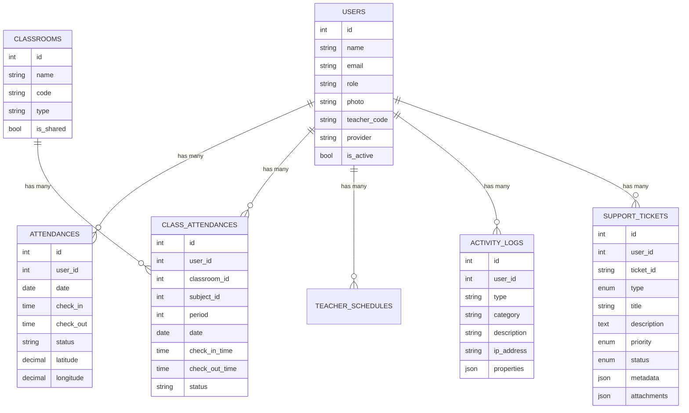
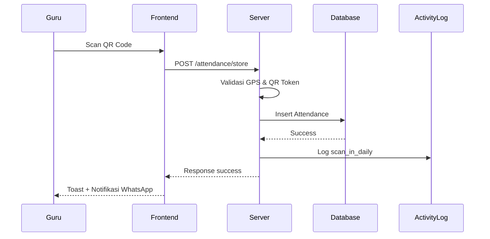

# 📚 ICB CT - Sistem Presensi Guru

<div align="center">


**Sistem Presensi Digital Modern untuk SMK ICB Cinta Teknika**

[🚀 Fitur](#-fitur) • [📦 Instalasi](#-instalasi) • [📖 Dokumentasi](#-dokumentasi) • [🤝 Kontribusi](#-kontribusi)

</div>

---

## Tentang Project

**ICB CT - Absensi Guru** adalah sistem presensi digital berbasis web yang dirancang khusus untuk SMK ICB Cinta Teknika. Sistem ini memungkinkan guru melakukan presensi harian dan presensi kelas dengan teknologi modern seperti QR Code scanning, GPS validation, real-time monitoring, dan audit trail lengkap.

### 🎯 Tujuan
- ✅ Digitalisasi proses presensi guru
- ✅ Meningkatkan akurasi data kehadiran
- ✅ Memudahkan monitoring real-time
- ✅ Mengurangi penggunaan kertas (paperless)
- ✅ Integrasi dengan sistem akademik sekolah
- ✅ Audit trail & keamanan sistem

---

## ✨ Fitur Unggulan

### Authentication & Authorization
- [x] Login dengan Email & Password
- [x] Login dengan Google OAuth
- [x] Multi-role (Admin, Guru, Operator)
- [x] Session management & auto-logout
- [x] Password reset via email
- [x] Modal sambutan saat login pertama

### Presensi Harian
- [x] Absen masuk & pulang dengan GPS validation
- [x] Radius-based validation (configurable)
- [x] Deteksi keterlambatan otomatis
- [x] Toleransi waktu yang bisa diatur
- [x] Riwayat presensi 7 hari terakhir
- [x] Statistik bulanan
- [x] Hardware scanner support (barcode scanner USB)

### 🏫 Presensi Kelas
- [x] QR Code scanning real-time via kamera
- [x] Mode Masuk & Keluar
- [x] Support shared space (Aula, Gor, Mushola)
- [x] On-demand class selection
- [x] Validasi durasi minimal mengajar
- [x] Jadwal mengajar otomatis

### 📡 Live Monitoring *(Baru)*
- [x] Dashboard real-time siapa yang sedang mengajar
- [x] Daftar guru yang belum scan masuk (dengan indikator keterlambatan)
- [x] Daftar guru yang masih di sekolah (belum scan keluar)
- [x] Auto-refresh setiap 15 detik via AJAX polling
- [x] Timer durasi mengajar berjalan di client (tick per detik)
- [x] Summary stats: Total Guru, Sudah Masuk, Sedang Mengajar, Belum Masuk, Sudah Keluar

### 🔍 Log Aktivitas *(Baru)*
- [x] Audit trail seluruh aktivitas sistem
- [x] Log presensi masuk/keluar harian & kelas
- [x] Log login/logout
- [x] Log perubahan data guru
- [x] Log perubahan pengaturan
- [x] Filter berdasarkan kategori, user, dan tanggal
- [x] Custom dropdown modern (Kategori & User)
- [x] Detail modal per log (browser, OS, device, IP, GPS)
- [x] Badge berwarna per jenis aktivitas
- [x] Export ke Excel (PhpSpreadsheet, dengan styling)
- [x] Cleanup log lama (configurable)

### 🆘 Pusat Bantuan *(Baru)*
- [x] Form laporan Bug, Request Fitur, Maintenance, Pertanyaan
- [x] Auto-detect metadata: browser, OS, device, IP
- [x] Upload lampiran: PNG, JPG, PDF, MP4 (drag & drop)
- [x] Integrasi webhook ke Vexalyn Dev Center (HTTPS + HMAC)
- [x] Feature toggle via `.env` (`SUPPORT_CENTER_ENABLED`)
- [x] Modal "Dalam Pengembangan" saat fitur di-nonaktifkan
- [x] Riwayat tiket dengan status tracking
- [x] Detail tiket dengan timeline
- [x] Tersedia untuk Admin & Guru

### ⚙️ Pengaturan Sistem
- [x] Identitas sekolah (nama, logo, favicon)
- [x] Zona waktu & bahasa (40+ timezone, 20+ bahasa)
- [x] Konfigurasi radius GPS dengan visualisasi peta
- [x] Custom color theme (Navy/Gold)
- [x] Notifikasi email & alert
- [x] Interactive map dengan Leaflet.js

### Laporan & Export
- [x] Laporan harian, mingguan, bulanan
- [x] Export ke Excel (presensi harian & kelas)
- [x] Export Log Aktivitas ke Excel (dengan header & styling)
- [x] Filter berdasarkan tanggal & guru
- [x] Statistik kehadiran real-time
- [x] Visualisasi data dengan chart

### 🎨 UI/UX Modern
- [x] Responsive design (mobile-first)
- [x] Dark mode support
- [x] Smooth animations & transitions
- [x] Custom dropdown Alpine.js (bukan native select)
- [x] Toast notifications
- [x] Loading states & skeleton
- [x] Modal animasi premium (spring cubic-bezier)

---

## ️ Tech Stack

<div align="center">

| Category | Technology | Version |
|----------|-----------|---------|
| **Backend** | Laravel | 12.x |
| **Frontend** | Alpine.js | 3.x |
| **Styling** | Tailwind CSS | 3.x |
| **Database** | MySQL | 8.0+ |
| **Maps** | Leaflet.js | 1.9.4 |
| **QR Code** | jsQR | 1.4.0 |
| **Icons** | Lucide Icons | Latest |
| **Charts** | Chart.js | 4.x |
| **Excel** | PhpSpreadsheet | 5.x |
| **Auth** | Laravel Socialite | 5.x |

</div>

---

## 📐 System Architecture

### 🗂️ Database Schema (Updated)



### 🔄 Presensi Flow



---

## 📦 Instalasi

### 📋 Requirements

- ✅ **PHP** >= 8.2
- ✅ **Composer** (Latest version)
- ✅ **Node.js** >= 16.x & **NPM**
- ✅ **MySQL** >= 8.0 atau **MariaDB** >= 10.3
- ✅ **Git**
- ✅ **Web Server** (Apache/Nginx) atau **PHP Built-in Server**

### 🚀 Step-by-Step Installation

#### 1️ Clone Repository

```bash
git clone https://github.com/vexalyn-dev/presensi-guru-icbct.git
cd presensi-guru-icbct
```

#### 2️⃣ Install Dependencies

```bash
composer install
npm install
```

#### 3️⃣ Konfigurasi Environment

```bash
cp .env.example .env
php artisan key:generate
```

Edit file `.env`:

```env
APP_NAME="ICB CT - Absensi Guru"
APP_URL=http://localhost:8000

DB_CONNECTION=mysql
DB_HOST=127.0.0.1
DB_PORT=3306
DB_DATABASE=icb_ct_absensi
DB_USERNAME=root
DB_PASSWORD=

# Google OAuth
GOOGLE_CLIENT_ID=your-client-id
GOOGLE_CLIENT_SECRET=your-client-secret
GOOGLE_REDIRECT_URI=http://localhost:8000/auth/google/callback

# Vexalyn Dev Center (Pusat Bantuan)
VEXALYN_API_URL=https://api.vexalyn.dev/v1
VEXALYN_API_KEY=
VEXALYN_PROJECT_ID=icb-ct-absensi-guru
VEXALYN_WEBHOOK_SECRET=
SUPPORT_CENTER_ENABLED=false
```

#### 4️⃣ Setup Database

```bash
php artisan migrate
php artisan db:seed   # opsional
```

#### 5️⃣ Jalankan

```bash
npm run build
php artisan storage:link
php artisan serve
```

Akses di: **http://localhost:8000**

---

## ⚙️ Konfigurasi

### 🔑 Google OAuth

1. Buka [Google Cloud Console](https://console.cloud.google.com/)
2. Enable **Google+ API** & buat OAuth 2.0 Client ID
3. Set redirect URI: `http://your-domain/auth/google/callback`
4. Isi `GOOGLE_CLIENT_ID` dan `GOOGLE_CLIENT_SECRET` di `.env`

### 🆘 Pusat Bantuan (Vexalyn Dev Center)

```env
VEXALYN_API_KEY=your_api_key
VEXALYN_WEBHOOK_SECRET=your_secret
SUPPORT_CENTER_ENABLED=true   # true = aktif, false = mode pengembangan
```

Setelah ubah `.env`, jalankan `php artisan config:clear`.

### 📧 Email

```env
MAIL_MAILER=smtp
MAIL_HOST=smtp.gmail.com
MAIL_PORT=587
MAIL_USERNAME=your-email@gmail.com
MAIL_PASSWORD=your-app-password
MAIL_ENCRYPTION=tls
```

---

## Dokumentasi

### 👥 Roles & Permissions

| Role | Value DB | Permissions |
|------|----------|-------------|
| **Administrator** | `admin` | Full access (legacy, backward compatible) |
| **Operator** | `operator` | Full access — identik dengan admin, termasuk Live Monitoring, Log Aktivitas, semua Data Master |
| **Guru** | `guru` | Presensi Harian, Presensi Kelas, Jadwal, Riwayat, Izin, Pusat Bantuan |
| **Guru Piket** | `guru_piket` | Presensi Harian, Manual Presensi, Approval Izin, Jadwal Kerja, Kalender Libur, Pusat Bantuan |

**Catatan:** `isAdmin()` di User model mengembalikan `true` untuk role `admin` **dan** `operator`. Middleware `role:admin` otomatis mengizinkan `operator` masuk tanpa perubahan route.

### 🔐 Demo Accounts

Jalankan seeder untuk membuat akun demo:

```bash
php artisan db:seed --class=DemoAccountSeeder
```

| Role | Email | Password |
|------|-------|----------|
| Operator | `operator@smkicb.sch.id` | `operator123` |
| Guru Piket | `piket@smkicb.sch.id` | `piket123` |

> Sebelum seeder, pastikan migration sudah dijalankan:
> ```bash
> php artisan migrate
> ```
> Atau jalankan SQL di phpMyAdmin:
> ```sql
> ALTER TABLE `users`
> MODIFY COLUMN `role` ENUM('admin','guru','operator','guru_piket') NOT NULL DEFAULT 'guru';
> ```

### 📡 Live Monitoring

Live Monitoring menggunakan **AJAX Polling 15 detik** via Alpine.js:

```
GET /admin/live-monitoring         → Halaman view
GET /admin/live-monitoring/refresh → JSON data (polling endpoint)
```

Data yang disajikan:
- **Sedang Mengajar**: ClassAttendance `check_in_time` ada, `check_out_time` null
- **Belum Scan Masuk**: TeachingSchedule hari ini yang jamnya sudah lewat tanpa scan
- **Masih di Sekolah**: Attendance harian `check_in` ada, `check_out` null
- **Sudah Selesai**: ClassAttendance lengkap IN + OUT

### 🔍 Log Aktivitas

| Type | Category | Label |
|------|----------|-------|
| `scan_in_daily` | attendance | Masuk Harian |
| `scan_out_daily` | attendance | Keluar Harian |
| `scan_in` | attendance | Masuk Kelas |
| `scan_out` | attendance | Keluar Kelas |
| `login` | auth | Login |
| `logout` | auth | Logout |
| `teacher_created` | teacher | Tambah Guru |
| `teacher_updated` | teacher | Ubah Guru |
| `teacher_deleted` | teacher | Hapus Guru |
| `settings_change` | settings | Ubah Pengaturan |

Menambahkan log baru:

```php
use App\Services\ActivityLogService;

ActivityLogService::log(
    'custom_type',
    'category',
    'Deskripsi aktivitas',
    $subject,      // Model (opsional)
    ['key' => 'value'],  // Extra properties
    $user          // User (null = auth()->user())
);
```

---

## 🧪 Testing

```bash
php artisan test
php artisan test --coverage
php artisan test --filter=AttendanceTest
```

---

## Deployment

### cPanel

1. Upload ke `home/username/presensi-app/`
2. Symlink `public/` ke `public_html/`
3. Update `.env` production
4. Jalankan di server:

```bash
composer install --optimize-autoloader --no-dev
php artisan migrate --force
php artisan config:cache
php artisan route:cache
php artisan view:cache
php artisan storage:link
```

### VPS (Ubuntu)

```bash
sudo apt update && sudo apt install php8.2-fpm php8.2-mysql nginx composer nodejs npm
git clone https://github.com/vexalyn-dev/presensi-guru-icbct.git /var/www/presensi
cd /var/www/presensi
composer install --optimize-autoloader --no-dev
npm install && npm run build
php artisan migrate --force
php artisan storage:link
```

---

## 🤝 Kontribusi

1. **Fork** repository
2. **Create branch** (`git checkout -b feature/NamaFitur`)
3. **Commit** (`git commit -m 'feat: tambah NamaFitur'`)
4. **Push** (`git push origin feature/NamaFitur`)
5. **Open Pull Request**

### Guidelines
- Ikuti PSR-12 coding standard
- Update dokumentasi jika menambah fitur baru
- Pastikan semua tests passing

---

## 🐛 Bug Reports

Gunakan **Pusat Bantuan** di dalam aplikasi (menu sidebar) atau buat GitHub Issue dengan template:

```markdown
**Deskripsi Bug:** ...
**Steps to Reproduce:** ...
**Expected Behavior:** ...
**Environment:** OS, Browser, Laravel Version
```

---

## 📄 License

MIT License — lihat [LICENSE](LICENSE) untuk detail.

---

## 👨‍💻 Developer Info

<div align="center">

### Made with ❤️ by

**Vexalyn Dev**

Full-Stack Developer

[](https://github.com/vexalyn-dev)
[](mailto:vioatmajaya@gmail.com)

</div>

---

## ☕ Support Project

<div align="center">

[](https://saweria.co/vexalyndev)
[](https://trakteer.id/vio_atmajaya)

</div>

---

## Acknowledgments

- [Tailwind CSS](https://tailwindcss.com/)
- [Alpine.js](https://alpinejs.dev/)
- [Leaflet.js](https://leafletjs.com/)
- [Lucide Icons](https://lucide.dev/)
- [Chart.js](https://www.chartjs.org/)
- [PhpSpreadsheet](https://phpspreadsheet.readthedocs.io/)
- [Laravel](https://laravel.com/)

---

## 📞 Contact

- 📧 **Email:** vioatmajaya@gmail.com
- 🌐 **Website:** [vexalyndev.my.id](https://vexalyndev.my.id/)
- 📱 **Live App:** [presensi-guru.smkicb-teknika.sch.id](https://presensi-guru.smkicb-teknika.sch.id)

---

<div align="center">

**⭐ Star this repo if you find it helpful!**

Made with ❤️ by **Vexalyn Dev** • © 2026 ICB Cinta Teknika

[⬆️ Back to Top](#-icb-ct---sistem-presensi-guru)
