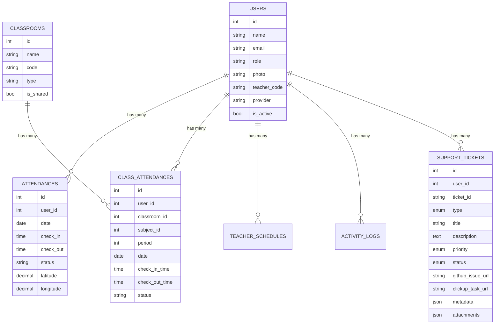
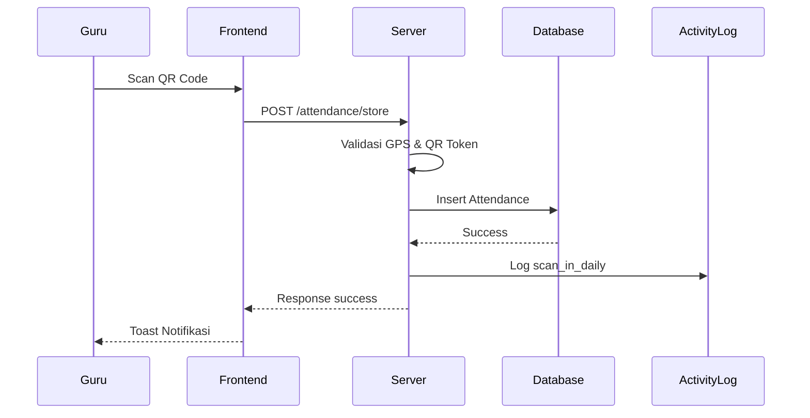
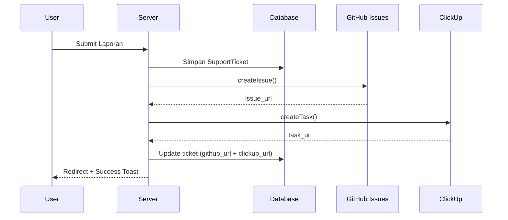

#  ICB CT - Sistem Presensi Guru

<div align="center">


[](https://github.com/vexalyn-dev/presensi-guru-icbct/stargazers)

**Sistem Presensi Digital Modern untuk SMK ICB Cinta Teknika**

[🚀 Fitur](#-fitur-unggulan) • [📦 Instalasi](#-instalasi) • [📖 Dokumentasi](#dokumentasi) • [🤝 Kontribusi](#-kontribusi)

</div>

---

## Tentang Project

**ICB CT - Absensi Guru** adalah sistem presensi digital berbasis web yang dirancang khusus untuk SMK ICB Cinta Teknika. Sistem ini memungkinkan guru melakukan presensi harian dan presensi kelas dengan teknologi modern seperti QR Code scanning, GPS validation, real-time monitoring, dan audit trail lengkap.

### 🎯 Tujuan
- ✅ Digitalisasi proses presensi guru
- ✅ Meningkatkan akurasi data kehadiran
- ✅ Memudahkan monitoring real-time
- ✅ Mengurangi penggunaan kertas (paperless)
- ✅ Integrasi dengan sistem akademik sekolah
- ✅ Audit trail & keamanan sistem

---

## ✨ Fitur Unggulan

### Authentication & Authorization
- [x] Login dengan Email & Password
- [x] Login dengan Google OAuth
- [x] Multi-role (Admin, Guru, Operator, Guru Piket)
- [x] Session management & auto-logout
- [x] Password reset via email
- [x] Modal sambutan saat login pertama

### Presensi Harian
- [x] Absen masuk & pulang dengan GPS validation
- [x] Radius-based validation (configurable)
- [x] Deteksi keterlambatan otomatis
- [x] Toleransi waktu yang bisa diatur
- [x] Riwayat presensi 7 hari terakhir
- [x] Statistik bulanan
- [x] Hardware scanner support (barcode scanner USB)

### 🏫 Presensi Kelas
- [x] QR Code scanning real-time via kamera
- [x] Mode Masuk & Keluar
- [x] Support shared space (Aula, Gor, Mushola)
- [x] On-demand class selection
- [x] Validasi durasi minimal mengajar
- [x] Jadwal mengajar otomatis

### 📡 Live Monitoring
- [x] Dashboard real-time siapa yang sedang mengajar
- [x] Daftar guru yang belum scan masuk (dengan indikator keterlambatan)
- [x] Daftar guru yang masih di sekolah (belum scan keluar)
- [x] Auto-refresh setiap 15 detik via AJAX polling
- [x] Timer durasi mengajar berjalan di client (tick per detik)
- [x] Summary stats: Total Guru, Sudah Masuk, Sedang Mengajar, Belum Masuk, Sudah Keluar

### 🔍 Log Aktivitas
- [x] Audit trail seluruh aktivitas sistem
- [x] Log presensi masuk/keluar harian & kelas
- [x] Log login/logout & perubahan data
- [x] Filter berdasarkan kategori, user, dan tanggal
- [x] Detail modal per log (browser, OS, device, IP, GPS)
- [x] Export ke Excel (PhpSpreadsheet, dengan styling)
- [x] Cleanup log lama (configurable)

### 🆘 Pusat Bantuan
- [x] Form laporan Bug, Request Fitur, Maintenance, Pertanyaan
- [x] Auto-detect metadata: browser, OS, device, IP
- [x] Upload lampiran: PNG, JPG, PDF, MP4 (drag & drop)
- [x] **Integrasi GitHub Issues** — tiket otomatis masuk ke GitHub
- [x] **Integrasi ClickUp** — tiket otomatis masuk sebagai task di ClickUp
- [x] Riwayat tiket dengan status tracking
- [x] Detail tiket dengan link ke GitHub & ClickUp
- [x] Tersedia untuk semua role

### 📱 Download APK
- [x] Halaman download APK mobile
- [x] Banner slider 4 slide dengan Netflix-style transition
- [x] Upload & manajemen APK dari Settings
- [x] Auto-extract metadata dari file APK (nama, versi, ukuran)
- [x] Info versi, min Android, ukuran tampil otomatis dari DB

### ⚙️ Pengaturan Sistem
- [x] Identitas sekolah (nama, logo, favicon)
- [x] Zona waktu & bahasa (40+ timezone, 20+ bahasa)
- [x] Konfigurasi radius GPS dengan visualisasi peta
- [x] Custom color theme (Navy/Gold)
- [x] Notifikasi email & alert
- [x] **Tab Aplikasi** — manajemen APK mobile (upload, versi, changelog)

### Laporan & Export
- [x] Laporan harian, mingguan, bulanan
- [x] Export ke Excel (presensi harian & kelas)
- [x] Export Log Aktivitas ke Excel (dengan header & styling)
- [x] Filter berdasarkan tanggal & guru
- [x] Statistik kehadiran real-time
- [x] Visualisasi data dengan chart

### 🎨 UI/UX Modern
- [x] Responsive design (mobile-first)
- [x] Dark mode support
- [x] Smooth animations & transitions
- [x] Custom dropdown Alpine.js (bukan native select)
- [x] Toast notifications
- [x] Loading states & skeleton
- [x] Modal animasi premium (spring cubic-bezier)

---

## ️ Tech Stack

<div align="center">

| Category | Technology | Version |
|----------|-----------|---------|
| **Backend** | Laravel | 12.x |
| **Frontend** | Alpine.js | 3.x |
| **Styling** | Tailwind CSS | 3.x |
| **Database** | MySQL | 8.0+ |
| **Maps** | Leaflet.js | 1.9.4 |
| **QR Code** | jsQR | 1.4.0 |
| **Icons** | Lucide Icons | Latest |
| **Charts** | Chart.js | 4.x |
| **Excel** | PhpSpreadsheet | 5.x |
| **Auth** | Laravel Socialite | 5.x |
| **Issue Tracking** | GitHub Issues + ClickUp | — |

</div>

---

## 📐 System Architecture

### 🗂️ Database Schema



### 🔄 Presensi Flow



### 🐛 Support Ticket Flow



---

## 📦 Instalasi

### 📋 Requirements

- ✅ **PHP** >= 8.2
- ✅ **Composer** (Latest version)
- ✅ **Node.js** >= 16.x & **NPM**
- ✅ **MySQL** >= 8.0 atau **MariaDB** >= 10.3
- ✅ **Git**
- ✅ **Web Server** (Apache/Nginx) atau **PHP Built-in Server**

### 🚀 Step-by-Step Installation

#### 1️⃣ Clone Repository

```bash
git clone https://github.com/vexalyn-dev/presensi-guru-icbct.git
cd presensi-guru-icbct
```

#### 2️⃣ Install Dependencies

```bash
composer install
npm install
```

#### 3️⃣ Konfigurasi Environment

```bash
cp .env.example .env
php artisan key:generate
```

Edit file `.env`:

```env
APP_NAME="ICB CT - Absensi Guru"
APP_URL=http://localhost:8000

DB_CONNECTION=mysql
DB_HOST=127.0.0.1
DB_PORT=3306
DB_DATABASE=icb_ct_absensi
DB_USERNAME=root
DB_PASSWORD=

# Google OAuth
GOOGLE_CLIENT_ID=your-client-id
GOOGLE_CLIENT_SECRET=your-client-secret
GOOGLE_REDIRECT_URI=http://localhost:8000/auth/google/callback

# GitHub Issues (Pusat Bantuan)
GITHUB_ISSUES_TOKEN=your-github-token
GITHUB_ISSUES_REPO=owner/repo

# ClickUp (Pusat Bantuan)
CLICKUP_API_TOKEN=your-clickup-token
CLICKUP_LIST_ID=your-list-id
CLICKUP_ENABLED=true
```

#### 4️⃣ Setup Database

```bash
php artisan migrate
php artisan db:seed   # opsional
```

#### 5️⃣ Jalankan

```bash
npm run build
php artisan storage:link
php artisan serve
```

Akses di: **http://localhost:8000**

---

## ⚙️ Konfigurasi

### 🔑 Google OAuth

1. Buka [Google Cloud Console](https://console.cloud.google.com/)
2. Enable **Google+ API** & buat OAuth 2.0 Client ID
3. Set redirect URI: `http://your-domain/auth/google/callback`
4. Isi `GOOGLE_CLIENT_ID` dan `GOOGLE_CLIENT_SECRET` di `.env`

### 🐛 Integrasi GitHub Issues

```env
GITHUB_ISSUES_TOKEN=ghp_xxxxxxxxxxxx
GITHUB_ISSUES_REPO=your-org/your-repo
```

### ✅ Integrasi ClickUp

```env
CLICKUP_API_TOKEN=pk_xxxxxxxxxxxx
CLICKUP_LIST_ID=xxxxxxxxxxxx
CLICKUP_ENABLED=true
```

Setelah ubah `.env`, jalankan `php artisan config:clear`.

### 📧 Email

```env
MAIL_MAILER=smtp
MAIL_HOST=smtp.gmail.com
MAIL_PORT=587
MAIL_USERNAME=your-email@gmail.com
MAIL_PASSWORD=your-app-password
MAIL_ENCRYPTION=tls
```

---

## Dokumentasi

### 👥 Roles & Permissions

| Role | Value DB | Permissions |
|------|----------|-------------|
| **Administrator** | `admin` | Full access (legacy, backward compatible) |
| **Operator** | `operator` | Full access — identik dengan admin, termasuk Live Monitoring, Log Aktivitas, semua Data Master |
| **Guru** | `guru` | Presensi Harian, Presensi Kelas, Jadwal, Riwayat, Izin, Pusat Bantuan |
| **Guru Piket** | `guru_piket` | Presensi Harian, Manual Presensi, Approval Izin, Jadwal Kerja, Kalender Libur, Pusat Bantuan |

### 🔐 Demo Accounts

```bash
php artisan db:seed --class=DemoAccountSeeder
```

| Role | Email | Password |
|------|-------|----------|
| Operator | `operator@smkicb.sch.id` | `operator123` |
| Guru Piket | `piket@smkicb.sch.id` | `piket123` |

### 📡 Live Monitoring

```
GET /admin/live-monitoring         → Halaman view
GET /admin/live-monitoring/refresh → JSON data (polling endpoint)
```

### 🔍 Log Aktivitas

| Type | Category | Label |
|------|----------|-------|
| `scan_in_daily` | attendance | Masuk Harian |
| `scan_out_daily` | attendance | Keluar Harian |
| `scan_in` | attendance | Masuk Kelas |
| `scan_out` | attendance | Keluar Kelas |
| `login` | auth | Login |
| `logout` | auth | Logout |
| `teacher_created` | teacher | Tambah Guru |
| `settings_change` | settings | Ubah Pengaturan |

---

## 🧪 Testing

```bash
php artisan test
php artisan test --coverage
```

---

## Deployment

### cPanel

```bash
composer install --optimize-autoloader --no-dev
php artisan migrate --force
php artisan config:cache
php artisan route:cache
php artisan view:cache
php artisan storage:link
```

### VPS (Ubuntu)

```bash
sudo apt update && sudo apt install php8.2-fpm php8.2-mysql nginx composer nodejs npm
git clone https://github.com/vexalyn-dev/presensi-guru-icbct.git /var/www/presensi
cd /var/www/presensi
composer install --optimize-autoloader --no-dev
npm install && npm run build
php artisan migrate --force
php artisan storage:link
```

---

## 🤝 Kontribusi

1. **Fork** repository
2. **Create branch** (`git checkout -b feature/NamaFitur`)
3. **Commit** (`git commit -m 'feat: tambah NamaFitur'`)
4. **Push** (`git push origin feature/NamaFitur`)
5. **Open Pull Request**

---

## 🐛 Bug Reports

Gunakan **Pusat Bantuan** di dalam aplikasi (menu sidebar) — laporan otomatis masuk ke GitHub Issues dan ClickUp.

---

## 📄 License

MIT License — lihat [LICENSE](LICENSE) untuk detail.

---

## 👨‍💻 Developer Info

<div align="center">

### Made with ❤️ by


**Vio Atmajaya Saputra**

[](https://github.com/vexalyn-dev)
[](mailto:vioatmajaya@gmail.com)
[](https://vexalyndev.my.id)

</div>

---

## ☕ Support Project

<div align="center">

[](https://saweria.co/vexalyndev)
[](https://trakteer.id/vio_atmajaya)

</div>

---

## Acknowledgments

- [Laravel](https://laravel.com/)
- [Tailwind CSS](https://tailwindcss.com/)
- [Alpine.js](https://alpinejs.dev/)
- [Leaflet.js](https://leafletjs.com/)
- [Lucide Icons](https://lucide.dev/)
- [Chart.js](https://www.chartjs.org/)
- [PhpSpreadsheet](https://phpspreadsheet.readthedocs.io/)
- [ClickUp API](https://clickup.com/api)

---

## 📞 Contact

- 📧 **Email:** vioatmajaya@gmail.com
- 🌐 **Website:** [vexalyndev.my.id](https://vexalyndev.my.id/)
- 📱 **Live App:** [presensi-guru.smkicb-teknika.sch.id](https://presensi-guru.smkicb-teknika.sch.id)

---

<div align="center">

**⭐ Star this repo if you find it helpful!**

Made with ❤️ by  • © 2026 ICB Cinta Teknika

[⬆️ Back to Top](#-icb-ct---sistem-presensi-guru)

</div>
