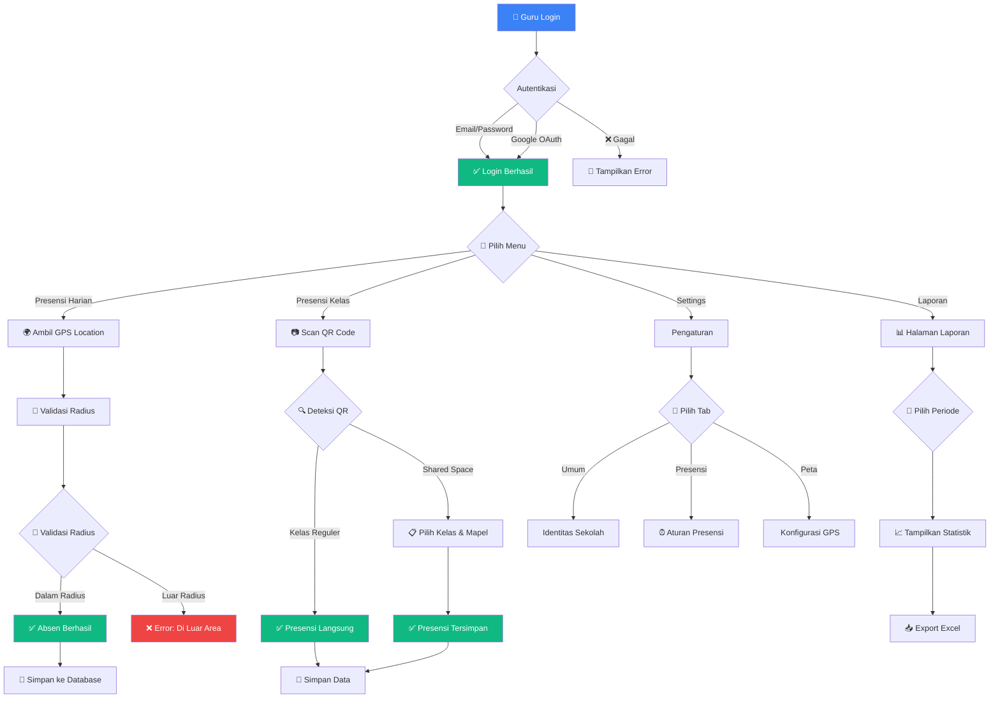
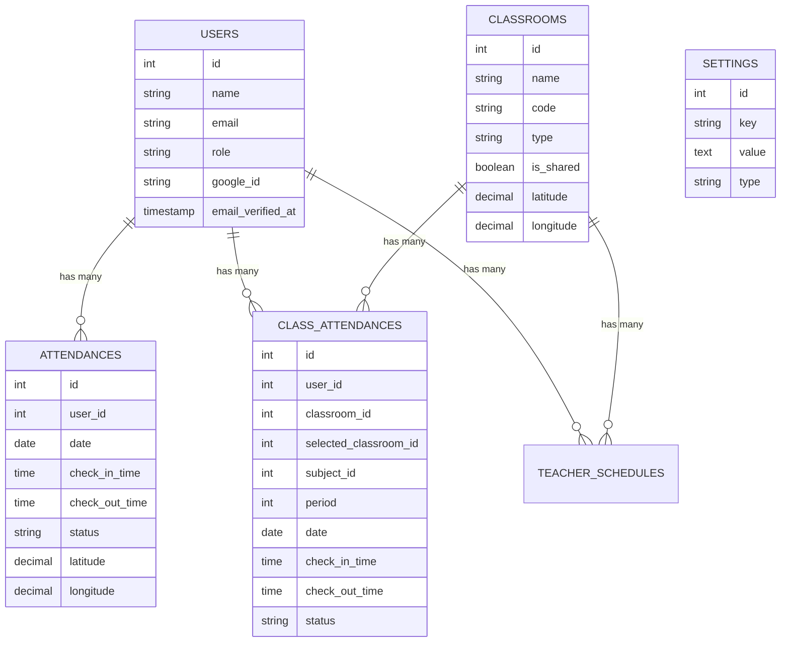
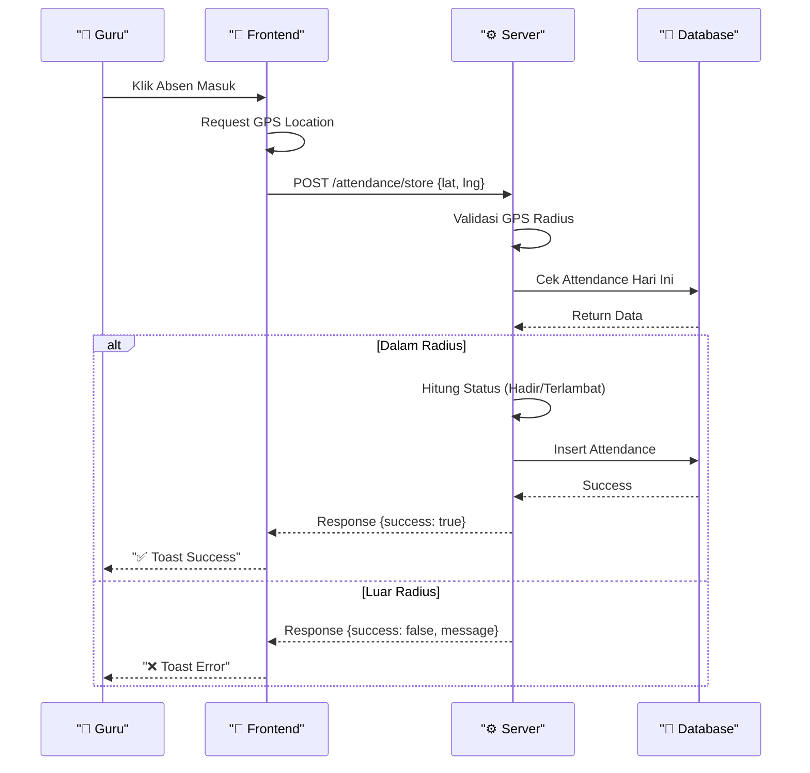

# 📚 ICB CT - Sistem Presensi Guru

<div align="center">


**Sistem Presensi Digital Modern untuk SMK ICB Cinta Teknika**

[🚀 Fitur](#-fitur) • [📦 Instalasi](#-instalasi) • [📖 Dokumentasi](#-dokumentasi) • [🤝 Kontribusi](#-kontribusi)

</div>

---

##  Tentang Project

**ICB CT - Absensi Guru** adalah sistem presensi digital berbasis web yang dirancang khusus untuk SMK ICB Cinta Teknika. Sistem ini memungkinkan guru melakukan presensi harian dan presensi kelas dengan teknologi modern seperti QR Code scanning, GPS validation, dan real-time monitoring.

### 🎯 Tujuan
- ✅ Digitalisasi proses presensi guru
- ✅ Meningkatkan akurasi data kehadiran
- ✅ Memudahkan monitoring real-time
- ✅ Mengurangi penggunaan kertas (paperless)
- ✅ Integrasi dengan sistem akademik sekolah

---

## ✨ Fitur Unggulan

###  Authentication & Authorization
- [x] Login dengan Email & Password
- [x] Login dengan Google OAuth
- [x] Multi-role (Admin, Guru, Operator)
- [x] Session management & auto-logout
- [x] Password reset via email

###  Presensi Harian
- [x] Absen masuk & pulang dengan GPS validation
- [x] Radius-based validation (configurable)
- [x] Deteksi keterlambatan otomatis
- [x] Toleransi waktu yang bisa diatur
- [x] Riwayat presensi 7 hari terakhir
- [x] Statistik bulanan

### 🏫 Presensi Kelas
- [x] QR Code scanning real-time
- [x] Mode Masuk & Keluar
- [x] Support shared space (Aula, Gor, Mushola)
- [x] On-demand class selection
- [x] Validasi durasi minimal mengajar
- [x] Jadwal mengajar otomatis

### ⚙️ Pengaturan Sistem
- [x] Identitas sekolah (nama, logo, favicon)
- [x] Zona waktu & bahasa (40+ timezone, 20+ bahasa)
- [x] Konfigurasi radius GPS dengan visualisasi peta
- [x] Custom color theme (Navy/Gold)
- [x] Notifikasi email & alert
- [x] Interactive map dengan Leaflet.js

###  Laporan & Export
- [x] Laporan harian, mingguan, bulanan
- [x] Export ke Excel (presensi harian & kelas)
- [x] Filter berdasarkan tanggal & guru
- [x] Statistik kehadiran real-time
- [x] Visualisasi data dengan chart

### 🎨 UI/UX Modern
- [x] Responsive design (mobile-first)
- [x] Dark mode support
- [x] Smooth animations & transitions
- [x] Custom dropdown dengan search
- [x] Toast notifications
- [x] Loading states

---

## ️ Tech Stack

<div align="center">

| Category | Technology | Version |
|----------|-----------|---------|
| **Backend** | Laravel | 10.x |
| **Frontend** | Alpine.js | 3.x |
| **Styling** | Tailwind CSS | 3.x |
| **Database** | MySQL | 8.0+ |
| **Maps** | Leaflet.js | 1.9.4 |
| **QR Code** | jsQR | 1.4.0 |
| **Icons** | Lucide Icons | Latest |
| **Charts** | Chart.js | 4.x |
| **Auth** | Laravel Socialite | 5.x |

</div>

---

## 📐 System Architecture

### 🔄 Flowchart Sistem Presensi



### 🗂️ Database Schema



### 🔄 Presensi Flow



---

## 📦 Instalasi

### 📋 Requirements

Sebelum memulai, pastikan sistem Anda memenuhi requirements berikut:

- ✅ **PHP** >= 8.2
- ✅ **Composer** (Latest version)
- ✅ **Node.js** >= 16.x & **NPM**
- ✅ **MySQL** >= 8.0 atau **MariaDB** >= 10.3
- ✅ **Git**
- ✅ **Web Server** (Apache/Nginx) atau **PHP Built-in Server**

### 🚀 Step-by-Step Installation

#### 1️ Clone Repository

```bash
# Clone dari GitHub
git clone https://github.com/vexalyn-dev/presensi-guru-icbct.git

# Masuk ke directory project
cd presensi-guru-icbct
```

#### 2️⃣ Install Dependencies

```bash
# Install PHP dependencies
composer install

# Install Node.js dependencies
npm install
```

#### 3️⃣ Konfigurasi Environment

```bash
# Copy file environment
cp .env.example .env

# Generate application key
php artisan key:generate
```

Edit file `.env` sesuai konfigurasi Anda:

```env
APP_NAME="ICB CT - Absensi Guru"
APP_ENV=local
APP_KEY=base64:xxxxxxxxxxxxxxxxxxxxx
APP_DEBUG=true
APP_URL=http://localhost:8000

DB_CONNECTION=mysql
DB_HOST=127.0.0.1
DB_PORT=3306
DB_DATABASE=icb_ct_absensi
DB_USERNAME=root
DB_PASSWORD=

MAIL_MAILER=smtp
MAIL_HOST=smtp.gmail.com
MAIL_PORT=587
MAIL_USERNAME=your-email@gmail.com
MAIL_PASSWORD=your-app-password
MAIL_ENCRYPTION=tls
MAIL_FROM_ADDRESS=noreply@icbct.sch.id
MAIL_FROM_NAME="${APP_NAME}"
```

#### 4️⃣ Setup Database

```bash
# Jalankan migrations
php artisan migrate

# (Opsional) Seed database dengan data dummy
php artisan db:seed
```

#### 5️⃣ Build Frontend Assets

```bash
# Development
npm run dev

# Production
npm run build
```

#### 6️⃣ Storage Link

```bash
# Buat symbolic link untuk storage
php artisan storage:link
```

#### 7️⃣ Jalankan Server

```bash
# Start Laravel development server
php artisan serve
```

Aplikasi akan berjalan di: **http://localhost:8000**

---

## ⚙️ Konfigurasi

### 🔑 Google OAuth Setup

1. Buka [Google Cloud Console](https://console.cloud.google.com/)
2. Buat project baru atau pilih project yang ada
3. Enable **Google+ API**
4. Buat **OAuth 2.0 Client ID**
5. Tambahkan ke `.env`:

```env
GOOGLE_CLIENT_ID=your-client-id.apps.googleusercontent.com
GOOGLE_CLIENT_SECRET=your-client-secret
GOOGLE_REDIRECT_URI=http://localhost:8000/auth/google/callback
```

### 🗺️ Maps Configuration

Sistem menggunakan **Leaflet.js + OpenStreetMap** (gratis, no API key needed).

Untuk custom styling, edit di `resources/views/settings/index.blade.php`.

### 📧 Email Configuration

Untuk fitur notifikasi email, konfigurasi SMTP di `.env`:

```env
MAIL_MAILER=smtp
MAIL_HOST=smtp.gmail.com
MAIL_PORT=587
MAIL_USERNAME=your-email@gmail.com
MAIL_PASSWORD=your-app-password  # Gunakan App Password, bukan password biasa
MAIL_ENCRYPTION=tls
```

**Cara dapat App Password Gmail:**
1. Buka [Google Account](https://myaccount.google.com/security)
2. Aktifkan **2-Step Verification**
3. Cari **App Passwords**
4. Generate password untuk "Mail"

---

##  Dokumentasi

### 👥 Roles & Permissions

| Role | Permissions |
|------|-------------|
| **Admin** | Full access: Settings, Reports, User Management |
| **Guru** | Presensi Harian, Presensi Kelas, Lihat Jadwal |
| **Operator** | Manage Data Master, Generate Reports |

### 📍 GPS Validation

Sistem menggunakan **Haversine formula** untuk menghitung jarak antara koordinat guru dan sekolah:

```php
// app/Helpers/GpsHelper.php
public static function calculateDistance($lat1, $lon1, $lat2, $lon2) {
    $earthRadius = 6371000; // meters
    $dLat = deg2rad($lat2 - $lat1);
    $dLon = deg2rad($lon2 - $lon1);
    
    $a = sin($dLat/2) * sin($dLat/2) +
         cos(deg2rad($lat1)) * cos(deg2rad($lat2)) *
         sin($dLon/2) * sin($dLon/2);
    
    $c = 2 * atan2(sqrt($a), sqrt(1-$a));
    
    return $earthRadius * $c;
}
```

###  Custom Theme

Untuk mengubah warna tema, edit di **Settings → Tampilan**:

- **Primary Color:** Default `#0F172A` (Navy)
- **Accent Color:** Default `#FACC15` (Gold)

Warna akan otomatis apply ke seluruh aplikasi.

---

## 🧪 Testing

```bash
# Run all tests
php artisan test

# Run with coverage
php artisan test --coverage

# Run specific test
php artisan test --filter=AttendanceTest
```

---

##  Deployment

### Deploy ke cPanel

1. **Upload files** ke `home/username/presensi-app/`
2. **Copy folder `public/`** ke `public_html/presensi-guru/`
3. **Edit `index.php`** di public_html:
   ```php
   require __DIR__.'/../presensi-app/vendor/autoload.php';
   $app = require_once __DIR__.'/../presensi-app/bootstrap/app.php';
   ```
4. **Setup database** di cPanel
5. **Update `.env`** dengan credentials production
6. **Run commands:**
   ```bash
   composer install --optimize-autoloader --no-dev
   php artisan migrate --force
   php artisan config:cache
   php artisan route:cache
   php artisan view:cache
   ```

### Deploy ke VPS (Ubuntu)

```bash
# Install dependencies
sudo apt update
sudo apt install php8.1-fpm php8.1-mysql nginx composer nodejs npm

# Clone & setup
git clone https://github.com/vexalyn-dev/presensi-guru-icbct.git /var/www/presensi
cd /var/www/presensi
composer install --optimize-autoloader --no-dev
npm install && npm run build

# Setup Nginx
sudo nano /etc/nginx/sites-available/presensi

# Restart services
sudo systemctl restart nginx
sudo systemctl restart php8.1-fpm
```

---

## 🤝 Kontribusi

Kami sangat mengapresiasi kontribusi dari komunitas! Berikut cara berkontribusi:

1. **Fork** repository ini
2. **Create branch** fitur baru (`git checkout -b feature/AmazingFeature`)
3. **Commit** perubahan (`git commit -m 'Add some AmazingFeature'`)
4. **Push** ke branch (`git push origin feature/AmazingFeature`)
5. **Open Pull Request**

### 📝 Guidelines

- ✅ Ikuti PSR-12 coding standard
- ✅ Write tests untuk fitur baru
- ✅ Update dokumentasi jika perlu
- ✅ Pastikan semua tests passing

---

## 🐛 Bug Reports

Jika menemukan bug, silakan buat issue dengan template berikut:

```markdown
**Deskripsi Bug**
Jelaskan bug secara detail

**Steps to Reproduce**
1. Go to '...'
2. Click on '...'
3. Scroll down to '...'
4. See error

**Expected Behavior**
Apa yang seharusnya terjadi

**Screenshots**
Jika ada, tambahkan screenshot

**Environment:**
- OS: [e.g. Windows 10]
- Browser: [e.g. Chrome 91]
- Laravel Version: [e.g. 10.0]
```

---

## 📄 License

Project ini dilisensikan di bawah **MIT License**. Lihat file [LICENSE](LICENSE) untuk detail.

```
MIT License

Copyright (c) 2024 ICB Cinta Teknika

Permission is hereby granted, free of charge, to any person obtaining a copy
of this software and associated documentation files (the "Software"), to deal
in the Software without restriction, including without limitation the rights
to use, copy, modify, merge, publish, distribute, sublicense, and/or sell
copies of the Software, and to permit persons to whom the Software is
furnished to do so, subject to the following conditions:

The above copyright notice and this permission notice shall be included in all
copies or substantial portions of the Software.

THE SOFTWARE IS PROVIDED "AS IS", WITHOUT WARRANTY OF ANY KIND, EXPRESS OR
IMPLIED, INCLUDING BUT NOT LIMITED TO THE WARRANTIES OF MERCHANTABILITY,
FITNESS FOR A PARTICULAR PURPOSE AND NONINFRINGEMENT. IN NO EVENT SHALL THE
AUTHORS OR COPYRIGHT HOLDERS BE LIABLE FOR ANY CLAIM, DAMAGES OR OTHER
LIABILITY, WHETHER IN AN ACTION OF CONTRACT, TORT OR OTHERWISE, ARISING FROM,
OUT OF OR IN CONNECTION WITH THE SOFTWARE OR THE USE OR OTHER DEALINGS IN THE
SOFTWARE.
```

---

## 👨‍💻 Developer Info

<div align="center">

### Made with ❤️ by

**Vexalyn Dev**

Full-Stack Developer

[](https://github.com/vexalyn-dev)
[](mailto:vioatmajaya@gmail.com)

</div>

---

## ☕ Support Project

Jika Anda merasa project ini bermanfaat dan ingin mendukung pengembangan lebih lanjut, Anda bisa memberikan donasi melalui:

<div align="center">


[](https://saweria.co/vexalyndev)
[](https://trakteer.id/vio_atmajaya)

</div>

**Setiap donasi akan digunakan untuk:**
- 🚀 Development fitur baru
- 🐛 Bug fixing & maintenance
- 📚 Dokumentasi & tutorial
-  UI/UX improvements

---

##  Acknowledgments

-  [Tailwind CSS](https://tailwindcss.com/) - Utility-first CSS framework
- ⚡ [Alpine.js](https://alpinejs.dev/) - Lightweight JavaScript framework
- ️ [Leaflet.js](https://leafletjs.com/) - Interactive maps library
- 🎯 [Lucide Icons](https://lucide.dev/) - Beautiful & consistent icons
- 📊 [Chart.js](https://www.chartjs.org/) - Simple yet flexible charts
-  [Laravel](https://laravel.com/) - The PHP framework for web artisans

---

## 📞 Contact

Untuk pertanyaan, saran, atau kerjasama:

- 📧 **Email:** vioatmajaya@gmail.com
- 🌐 **Website:** [vexalyndev.my.id](https://vexalyndev.my.id/)
- 📱 **Presensi App:** [presensi-guru.smkicb-teknika.sch.id](https://presensi-guru.smkicb-teknika.sch.id)

---

<div align="center">

**⭐ Star this repo if you find it helpful!**

Made with ❤️ by **Vexalyn Dev** • © 2024 ICB Cinta Teknika

[⬆️ Back to Top](#-icb-ct---sistem-presensi-guru)
