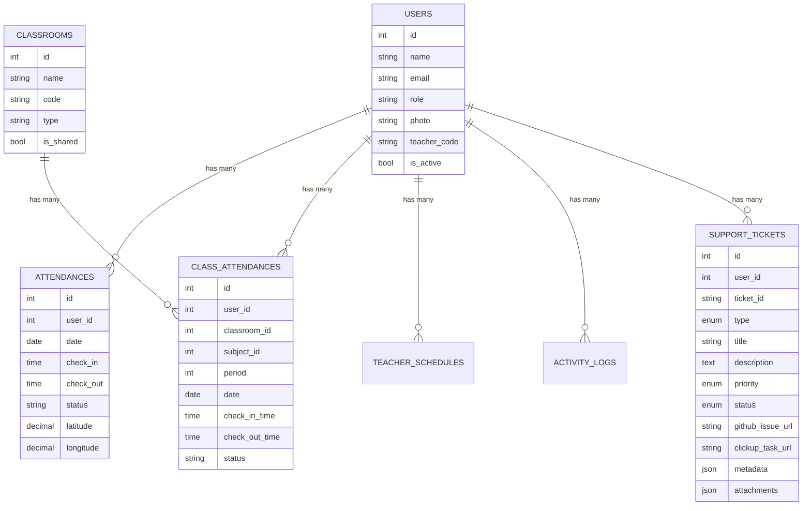
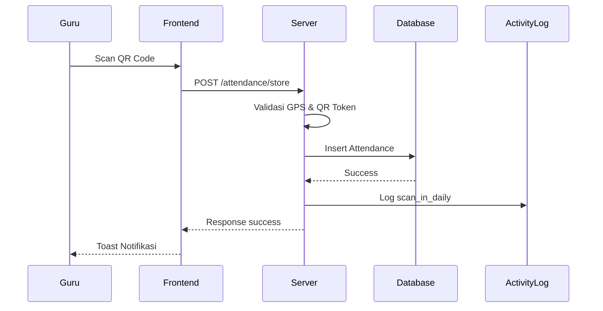
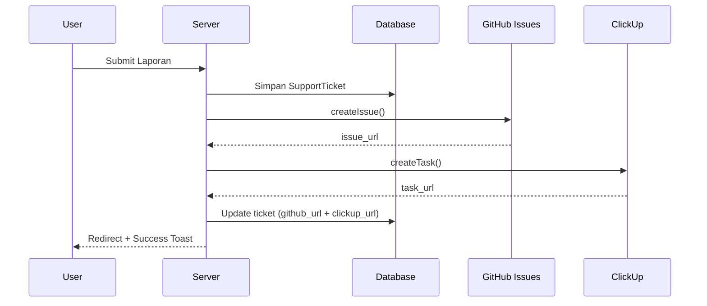

# 🏫 ICB CT — Sistem Presensi Guru

<div align="center">


[](https://github.com/vexalyn-dev/presensi-guru-icbct/stargazers)
[](https://github.com/vexalyn-dev/presensi-guru-icbct/forks)
[](https://github.com/vexalyn-dev/presensi-guru-icbct/graphs/contributors)
[](https://github.com/vexalyn-dev/presensi-guru-icbct/commits/main)
[](https://github.com/vexalyn-dev/presensi-guru-icbct/issues)

## Sistem Presensi Digital Modern untuk SMK ICB Cinta Teknika

[🚀 Fitur](#-fitur-unggulan) • [📦 Instalasi](#-instalasi) • [📖 Dokumentasi](docs/README.md) • [🤝 Kontribusi](#-kontribusi)

</div>

---

## Tentang Project

**ICB CT - Presensi Guru** adalah sistem presensi digital berbasis web yang dirancang khusus untuk SMK ICB Cinta Teknika. Sistem ini memungkinkan guru melakukan presensi harian dan presensi kelas dengan teknologi modern seperti QR Code scanning, GPS validation, real-time monitoring, dan audit trail lengkap.

### 🎯 Tujuan

- ✅ Digitalisasi proses presensi guru
- ✅ Meningkatkan akurasi data kehadiran
- ✅ Memudahkan monitoring real-time
- ✅ Mengurangi penggunaan kertas (paperless)
- ✅ Integrasi dengan sistem akademik sekolah
- ✅ Audit trail & keamanan sistem

---

## ✨ Fitur Unggulan

### Authentication & Authorization

- [x] Login dengan Email & Password
- [x] Multi-role (Admin, Guru, Operator, Guru Piket)
- [x] Session management & auto-logout
- [x] Password reset via email
- [x] Modal sambutan saat login pertama

### Presensi Harian

- [x] Absen masuk & pulang dengan GPS validation
- [x] Radius-based validation (configurable)
- [x] Deteksi keterlambatan otomatis
- [x] Toleransi waktu yang bisa diatur
- [x] Riwayat presensi 7 hari terakhir
- [x] Statistik bulanan
- [x] Hardware scanner support (barcode scanner USB)
- [x] Mode Otomatis — scan QR langsung proses tanpa klik konfirmasi
- [x] Mode Manual — perlu konfirmasi guru piket sebelum presensi tercatat
- [x] Auto-detect Masuk/Keluar berdasarkan status absen hari itu

### 🏫 Presensi Kelas

- [x] QR Code scanning real-time via kamera
- [x] Mode Masuk & Keluar
- [x] Support shared space (Aula, Gor, Mushola)
- [x] On-demand class selection
- [x] Validasi durasi minimal mengajar
- [x] Jadwal mengajar otomatis
- [x] **Download QR Code bergambar template** — generate gambar kelas ke file `.png` menggunakan HTML5 Canvas (overlay QR ke desain template `public/images/qr-code.png`, ukuran 707×1000 px, nama kelas otomatis di bagian bawah)

### 📡 Live Monitoring

- [x] Dashboard real-time siapa yang sedang mengajar
- [x] Daftar guru yang belum scan masuk (dengan indikator keterlambatan)
- [x] Daftar guru yang masih di sekolah (belum scan keluar)
- [x] Auto-refresh setiap 15 detik via AJAX polling
- [x] Timer durasi mengajar berjalan di client (tick per detik)
- [x] Summary stats: Total Guru, Sudah Masuk, Sedang Mengajar, Belum Masuk, Sudah Keluar

### 🔍 Log Aktivitas

- [x] Audit trail seluruh aktivitas sistem
- [x] Log presensi masuk/keluar harian & kelas
- [x] Log login/logout & perubahan data
- [x] Filter berdasarkan kategori, user, dan tanggal
- [x] Detail modal per log (browser, OS, device, IP, GPS)
- [x] Export ke Excel (PhpSpreadsheet, dengan styling)
- [x] Cleanup log lama (configurable)

### 🆘 Pusat Bantuan

- [x] Form laporan Bug, Request Fitur, Maintenance, Pertanyaan
- [x] Auto-detect metadata: browser, OS, device, IP
- [x] Upload lampiran: PNG, JPG, PDF, MP4 (drag & drop)
- [x] Integrasi GitHub Issues — tiket otomatis masuk ke GitHub
- [x] Integrasi ClickUp — tiket otomatis masuk sebagai task di ClickUp
- [x] Riwayat tiket dengan status tracking
- [x] Detail tiket dengan link ke GitHub & ClickUp
- [x] Tersedia untuk semua role

### 🔒 Keamanan & Proteksi

- [x] Content Security Policy (CSP)** — header anti-XSS global
- [x] X-Frame-Options DENY** — proteksi clickjacking
- [x] Rate Limiting** — login (10/menit), register (5/menit), forgot-password (3/menit)
- [x] CSRF Protection** — semua form POST wajib token
- [x] SSRF Protection** — validasi host URL di service
- [x] IDOR Prevention** — ownership check di semua endpoint data sensitif
- [x] XSS Prevention** — escaping user input di JavaScript DOM
- [x] Secure Session** — cookie HTTPS-only, encrypt, http_only
- [x] Password Enforcement** — bcrypt rounds 12, random password saat import
- [x] Email Enumeration Prevention** — response message seragam
- [x] QR Token Rotation** — token lama invalid setelah regenerate
- [x] PII Minimization** — QR code tanpa nama/email
- [x] MIME Validation** — base64 image upload diverifikasi
- [x] CRLF Injection Prevention** — sanitasi filename export
- [x] Error Message Sanitization** — exception detail tidak terekspose
- [x] Open Redirect Prevention** — validasi origin URL

### 📱 Download APK

- [x] Halaman download APK mobile
- [x] Banner slider 4 slide dengan Netflix-style transition
- [x] Upload & manajemen APK dari Settings
- [x] Auto-extract metadata dari file APK (nama, versi, ukuran)
- [x] Info versi, min Android, ukuran tampil otomatis dari DB

### ⚙️ Pengaturan Sistem

- [x] Identitas sekolah (nama, logo, favicon)
- [x] Zona waktu & bahasa (40+ timezone, 20+ bahasa)
- [x] Konfigurasi radius GPS dengan visualisasi peta
- [x] Custom color theme (Navy/Gold)
- [x] Notifikasi email & alert
- [x] **Tab Aplikasi** — manajemen APK mobile (upload, versi, changelog)

### Laporan & Export

- [x] Laporan harian, mingguan, bulanan
- [x] Export ke Excel (presensi harian & kelas)
- [x] Export Log Aktivitas ke Excel (dengan header & styling)
- [x] Filter berdasarkan tanggal & guru
- [x] Statistik kehadiran real-time
- [x] Visualisasi data dengan chart

### 🎨 UI/UX Modern

- [x] Responsive design (mobile-first)
- [x] Dark mode support
- [x] Smooth animations & transitions
- [x] Custom dropdown Alpine.js (bukan native select)
- [x] Toast notifications
- [x] Loading states & skeleton
- [x] Modal animasi premium (spring cubic-bezier)

---

## 📸 Screenshots

Tampilan lengkap semua halaman ada di **[`docs/`](docs/README.md)**.

---

## ️ Tech Stack

<div align="center">

| Category | Technology | Version |
| ---------- | ----------- | --------- |
| **Backend** | Laravel | 12.x |
| **Frontend** | Alpine.js | 3.x |
| **Styling** | Tailwind CSS | 3.x |
| **Database** | MySQL | 8.0+ |
| **Maps** | Leaflet.js | 1.9.4 |
| **QR Code** | jsQR | 1.4.0 |
| **Icons** | Lucide Icons | Latest |
| **Charts** | Chart.js | 4.x |
| **Issue Tracking** | GitHub Issues + ClickUp | — |

</div>

---

## 📐 System Architecture

### 🗂️ Database Schema


```mermaid
erDiagram
    USERS ||--o{ ATTENDANCES : "has many"
    USERS ||--o{ CLASS_ATTENDANCES : "has many"
    USERS ||--o{ TEACHER_SCHEDULES : "has many"
    USERS ||--o{ ACTIVITY_LOGS : "has many"
    USERS ||--o{ SUPPORT_TICKETS : "has many"
    USERS {
        int id
        string name
        string email
        string role
        string photo
        string teacher_code
        bool is_active
    }
    ATTENDANCES {
        int id
        int user_id
        date date
        time check_in
        time check_out
        string status
        decimal latitude
        decimal longitude
    }
    CLASS_ATTENDANCES {
        int id
        int user_id
        int classroom_id
        int subject_id
        int period
        date date
        time check_in_time
        time check_out_time
        string status
    }
    SUPPORT_TICKETS {
        int id
        int user_id
        string ticket_id
        enum type
        string title
        text description
        enum priority
        enum status
        string github_issue_url
        string clickup_task_url
        json metadata
        json attachments
    }
    CLASSROOMS ||--o{ CLASS_ATTENDANCES : "has many"
    CLASSROOMS {
        int id
        string name
        string code
        string type
        bool is_shared
    }
```

### 🔄 Presensi Flow


```mermaid
sequenceDiagram
    participant G as Guru
    participant F as Frontend
    participant S as Server
    participant D as Database
    participant L as ActivityLog

    G->>F: Scan QR Code
    F->>S: POST /attendance/store
    S->>S: Validasi GPS & QR Token
    S->>D: Insert Attendance
    D-->>S: Success
    S->>L: Log scan_in_daily
    S-->>F: Response success
    F-->>G: Toast Notifikasi
```

### 🐛 Support Ticket Flow


```mermaid
sequenceDiagram
    participant U as User
    participant S as Server
    participant D as Database
    participant GH as GitHub Issues
    participant CU as ClickUp

    U->>S: Submit Laporan
    S->>D: Simpan SupportTicket
    S->>GH: createIssue()
    GH-->>S: issue_url
    S->>CU: createTask()
    CU-->>S: task_url
    S->>D: Update ticket (github_url + clickup_url)
    S-->>U: Redirect + Success Toast
```

---

## 📦 Instalasi

### 📋 Requirements

- ✅ **PHP** >= 8.2
- ✅ **Composer** (Latest version)
- ✅ **Node.js** >= 16.x & **NPM**
- ✅ **MySQL** >= 8.0 atau **MariaDB** >= 10.3
- ✅ **Git**
- ✅ **Web Server** (Apache/Nginx) atau **PHP Built-in Server**

### 🚀 Step-by-Step Installation

#### 1️⃣ Clone Repository

```bash
git clone https://github.com/vexalyn-dev/presensi-guru-icbct.git
cd presensi-guru-icbct
```

#### 2️⃣ Install Dependencies

```bash
composer install
npm install
```

#### 3️⃣ Konfigurasi Environment

```bash
cp .env.example .env
php artisan key:generate
```

Edit file `.env`:

```env
APP_NAME="ICB CT - Presensi Guru"
APP_URL=http://localhost:8000

DB_CONNECTION=mysql
DB_HOST=127.0.0.1
DB_PORT=3306
DB_DATABASE=icb_ct_Presensi
DB_USERNAME=root
DB_PASSWORD=

# GitHub Issues (Pusat Bantuan)
GITHUB_ISSUES_TOKEN=token-github-lu
GITHUB_ISSUES_REPO=owner/repo

# ClickUp (Pusat Bantuan)
CLICKUP_API_TOKEN=your-clickup-token
CLICKUP_LIST_ID=your-list-id
CLICKUP_ENABLED=true
```

#### 4️⃣ Setup Database

```bash
php artisan migrate
php artisan db:seed   # opsional
```

#### 5️⃣ Jalankan

```bash
npm run build
php artisan storage:link
php artisan serve
```

Akses di: **<http://localhost:8000>**

---

## ⚙️ Konfigurasi

### 🐛 Integrasi GitHub Issues

```env
GITHUB_ISSUES_TOKEN=ghp_xxxxxxxxxxxx
GITHUB_ISSUES_REPO=your-org/your-repo
```

### ✅ Integrasi ClickUp

```env
CLICKUP_API_TOKEN=pk_xxxxxxxxxxxx
CLICKUP_LIST_ID=xxxxxxxxxxxx
CLICKUP_ENABLED=true
```

Setelah ubah `.env`, jalankan `php artisan config:clear`.

### 📧 Email

> Bebas mau pake yang mana — SMTP atau Resend, dua-duanya didukung. Pilih sesuai selera.

**Opsi 1 — SMTP** (pake Gmail atau SMTP provider lain)

```env
MAIL_MAILER=smtp
MAIL_HOST=smtp.gmail.com
MAIL_PORT=587
MAIL_USERNAME=your-email@gmail.com
MAIL_PASSWORD=your-app-password   # buat app password dulu di Google Account
MAIL_ENCRYPTION=tls
MAIL_FROM_ADDRESS=your-email@gmail.com
MAIL_FROM_NAME="${APP_NAME}"
```

**Opsi 2 — Resend** (lebih simpel, recommended buat production)

```env
MAIL_MAILER=resend
RESEND_API_KEY=re_xxxxxxxxxxxx    # dapet dari dashboard resend.com
MAIL_FROM_ADDRESS=noreply@domainlu.sch.id
MAIL_FROM_NAME="${APP_NAME}"
```

> 💡 Resend gratis sampai 3.000 email/bulan — cocok banget buat yang suka gratisan. Daftar di [resend.com](https://resend.com).

Project ini udah dicek keamanannya dari berbagai sisi, ini daftarnya:

| Kategori | Status |
| ---------- | -------- |
| SQL Injection | ✅ Dilindungi ORM Laravel |
| XSS (Stored/Reflected) | ✅ CSP + escaping DOM |
| CSRF | ✅ Token wajib di semua form |
| IDOR | ✅ Ownership check di semua endpoint |
| SSRF | ✅ Host allowlist di service |
| Brute Force | ✅ Rate limiting di auth |
| Session Hijacking | ✅ Secure cookie + encrypt |
| Command Injection | ✅ Admin-only + key-based |
| Email Enumeration | ✅ Generic response message |
| Open Redirect | ✅ Origin validation |

### Environment Variables yang Wajib Diisi

Edit `.env` sesuai kebutuhan:

```env
# Keamanan
APP_DEBUG=false                    # JANGAN aktifkan di production!
SESSION_SECURE_COOKIE=true         # Cookie hanya kirim via HTTPS

# Database
DB_CONNECTION=mysql
DB_HOST=127.0.0.1
DB_PORT=3306
DB_DATABASE=icb_ct_Presensi
DB_USERNAME=root
DB_PASSWORD=password-db-lu kalo mau di kosongin kosongin aja

# Email (Resend / SMTP)
MAIL_MAILER=resend
RESEND_API_KEY=key-resend-lu
```

### 🔐 Production Checklist

Sebelum deploy ke production, pastikan:

```bash
# 1. Generate unique APP_KEY
php artisan key:generate

# 2. Set APP_DEBUG ke false di .env.production
# APP_DEBUG=false

# 3. Build assets
npm run build

# 4. Run migrations
php artisan migrate --force

# 5. Cache everything
php artisan config:cache
php artisan route:cache
php artisan view:cache
```

### 👥 Roles & Permissions

| Role | Value DB | Permissions |
| ------ | ---------- | ------------- |
| Administrator | `admin` | Full access (legacy, backward compatible) |
| Operator | `operator` | Full access — identik dengan admin, termasuk Live Monitoring, Log Aktivitas, semua Data Master |
| Guru | `guru` | Presensi Harian, Presensi Kelas, Jadwal, Riwayat, Izin, Pusat Bantuan |
| Guru Piket | `guru_piket` | Presensi Harian, Manual Presensi, Approval Izin, Jadwal Kerja, Kalender Libur, Pusat Bantuan |

### 🔐 Demo Accounts

```bash
php artisan db:seed --class=DemoAccountSeeder
```

| Role | Email | Password |
| ------ | ------- | ---------- |
| Admin | `admin@smkicb.sch.id` | `Adminicb123` |
| Operator | `operator@smkicb.sch.id` | `Operatoricb123` |
| Guru Piket | `piket@smkicb.sch.id` | `Piketicb123` |
| Guru | `guru@smkicb.sch.id` | `Guruicb123` |
| Developer | *see `.env`* | *see `.env`* |

> **Developer** — login via halaman biasa, otomatis redirect ke Dev Panel.
> Akun developer dikonfigurasi via `.env`:
>
> ```env
> DEV_EMAIL=dev@vexalyndev.my.id
> DEV_PASSWORD=VexalynDev2026!
> DEV_NAME=Vexalyn Dev
> DEV_TEACHER_CODE=DEV-001
> ```

### 📡 Live Monitoring API

```http
GET /admin/live-monitoring         → Halaman view
GET /admin/live-monitoring/refresh → JSON data (polling endpoint)
```

### 🔍 Log Aktivitas API

| Type | Category | Label |
| ------ | ---------- | ------- |
| `scan_in_daily` | attendance | Masuk Harian |
| `scan_out_daily` | attendance | Keluar Harian |
| `scan_in` | attendance | Masuk Kelas |
| `scan_out` | attendance | Keluar Kelas |
| `login` | auth | Login |
| `logout` | auth | Logout |
| `teacher_created` | teacher | Tambah Guru |
| `settings_change` | settings | Ubah Pengaturan |

---

## 🧪 Testing

```bash
php artisan test
php artisan test --coverage
```

---

## Deployment

### cPanel

```bash
composer install --optimize-autoloader --no-dev
php artisan migrate --force
php artisan config:cache
php artisan route:cache
php artisan view:cache
php artisan storage:link
```

### VPS (Ubuntu)

```bash
sudo apt update && sudo apt install php8.2-fpm php8.2-mysql nginx composer nodejs npm
git clone https://github.com/vexalyn-dev/presensi-guru-icbct.git /var/www/presensi
cd /var/www/presensi
composer install --optimize-autoloader --no-dev
npm install && npm run build
php artisan migrate --force
php artisan storage:link
```

---

## 🤝 Kontribusi

1. **Fork** repository
2. **Create branch** (`git checkout -b feature/NamaFitur`)
3. **Commit** (`git commit -m 'feat: tambah NamaFitur'`)
4. **Push** (`git push origin feature/NamaFitur`)
5. **Open Pull Request**

---

## 🐛 Bug Reports

Ada bug atau kendala? Tersedia 3 jalur laporan:

### 1. Pusat Bantuan (Direkomendasikan)

Gunakan menu **Pusat Bantuan** di dalam aplikasi — laporan otomatis masuk ke GitHub Issues dan ClickUp lengkap dengan metadata (browser, OS, IP, screenshot).

### 2. WhatsApp

Hubungi developer langsung jika butuh respons cepat:

[](https://wa.me/6283898980808)

> **+62 838-9898-0808** — sertakan deskripsi masalah, screenshot, dan langkah reproduksi.

### 3. Email

Kirim laporan tertulis ke:

[](mailto:vioatmajaya@gmail.com?subject=[BUG]%20ICB%20CT%20Presensi%20-%20Nama%20Bug&body=Deskripsi%20bug%3A%0A%0ALangkah%20reproduksi%3A%0A1.%20...%0A2.%20...%0A%0AExpected%20behavior%3A%0A%0AActual%20behavior%3A%0A%0AScreenshot%20%2F%20log%3A)

> Subject: `[BUG] ICB CT Presensi - Deskripsi Singkat`

---

### Format Laporan yang Baik

```text
Judul     : [BUG] Nama masalah singkat
Deskripsi : Apa yang terjadi?
Langkah   : 1. Buka halaman X → 2. Klik tombol Y → 3. Error muncul
Expected  : Seharusnya terjadi apa?
Actual    : Yang terjadi sekarang apa?
Device    : HP/PC, Browser, OS
Screenshot: (lampirkan jika ada)
```

---

## 📄 License

Project ini dilisensikan di bawah **Creative Commons Attribution-NonCommercial 4.0 (CC BY-NC 4.0)**.

Intinya gini:

- ✅ **Boleh** dipake buat keperluan pribadi, belajar, atau tugas sekolah/kampus
- ✅ **Boleh** dimodifikasi sesuai kebutuhan
- ✅ **Boleh** disebarkan ulang, asal tetap kasih kredit ke developernya
- ❌ **Nggak boleh** dijual atau dikomersialisasi tanpa izin tertulis
- ❌ **Nggak boleh** hapus credit atau ngaku-ngaku ini project lo sendiri
- ❌ **Nggak boleh** reupload ulang dengan nama/identitas berbeda seolah-olah lu yang bikin

> Minimal satu hal yang gampang banget: **hargain developernya**. Kalau mau modif silakan, kalau mau pake buat tugas juga boleh tapi yang penting jangan hapus creditnya dan jangan ngaku ini buatan lo. Sesederhana itu. 🙏

Lihat [LICENSE](LICENSE) untuk teks lengkapnya.

---

## 👨‍💻 Developer Info

<div align="center">


### ✦ Vio Atmajaya Saputra ✦

> *Crafting clean code, elegant UI, and scalable systems.*

---

| | |
| :---: | :--- |
| 🧑‍💻 **Developer** | Vexalyn Dev |
| 📧 **Email** | <vioatmajaya@gmail.com> |
| 🌐 **Website** | [vexalyndev.my.id](https://vexalyndev.my.id) |
| 🐙 **GitHub** | [github.com/vexalyn-dev](https://github.com/vexalyn-dev) |
| 📱 **Live App** | [presensi-guru.smkicb-teknika.sch.id](https://presensi-guru.smkicb-teknika.sch.id) |

---

[](https://github.com/vexalyn-dev)
[](mailto:vioatmajaya@gmail.com)
[](https://vexalyndev.my.id)

</div>

---

## ☕ Support Project

<div align="center">

[](https://saweria.co/vexalyndev)
[](https://trakteer.id/vio_atmajaya)

</div>

---

## Acknowledgments

- [Laravel](https://laravel.com/)
- [Tailwind CSS](https://tailwindcss.com/)
- [Alpine.js](https://alpinejs.dev/)
- [Leaflet.js](https://leafletjs.com/)
- [Chart.js](https://www.chartjs.org/)
- [PhpSpreadsheet](https://phpspreadsheet.readthedocs.io/)
- [ClickUp API](https://clickup.com/api)

---

## 📞 Contact

- 📧 **Email:** <vioatmajaya@gmail.com>
- 🌐 **Website:** [vexalyndev.my.id](https://vexalyndev.my.id/)
- 📱 **Live App:** [presensi-guru.smkicb-teknika.sch.id](https://presensi-guru.smkicb-teknika.sch.id)

---

<div align="center">

**⭐ Star this repo if you find it helpful!**

---

```text
Made with ❤️ by Vexalyn Dev  •  © 2026 ICB Cinta Teknika
```

[⬆️ Back to Top](#-icb-ct--sistem-presensi-guru)

</div>
