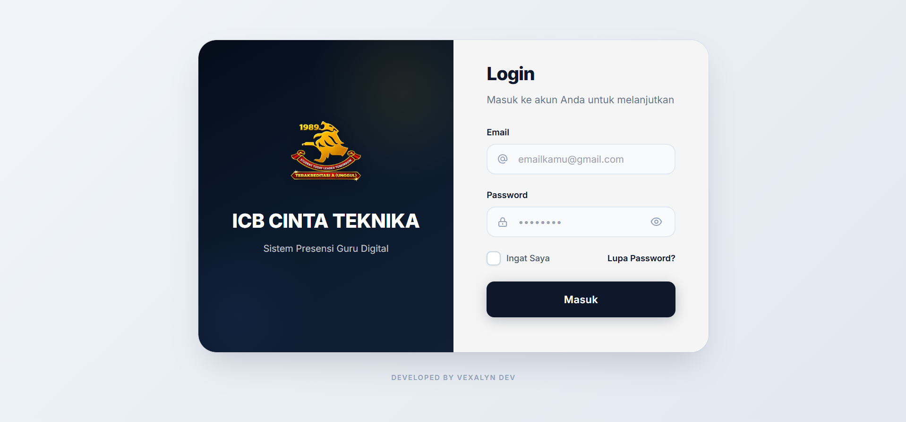
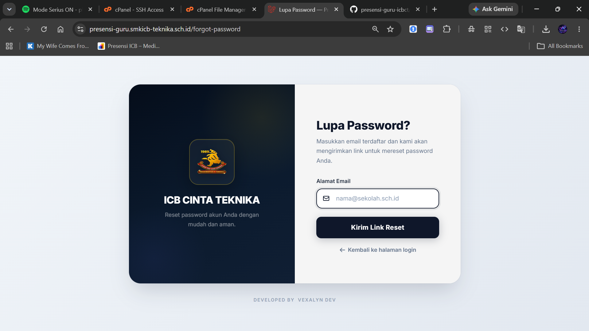
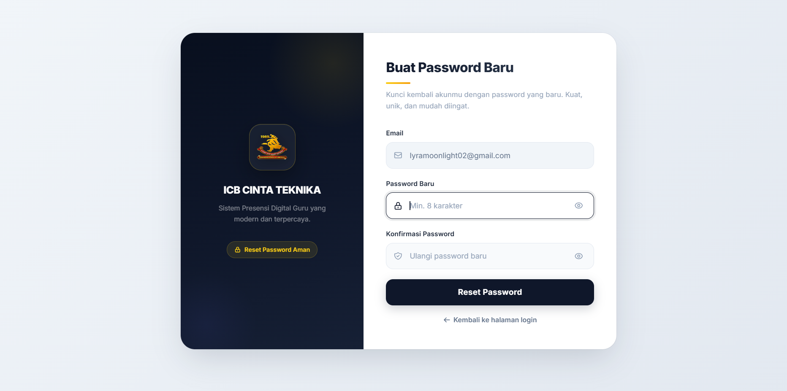
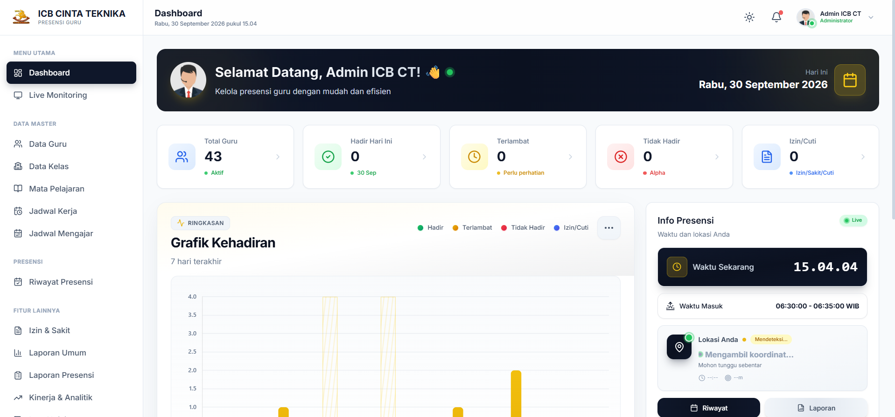
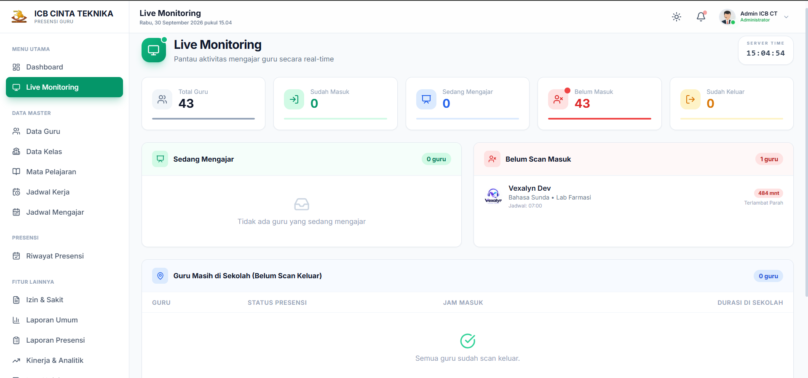
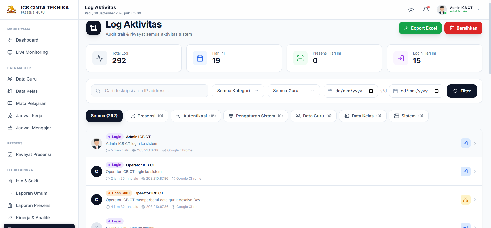
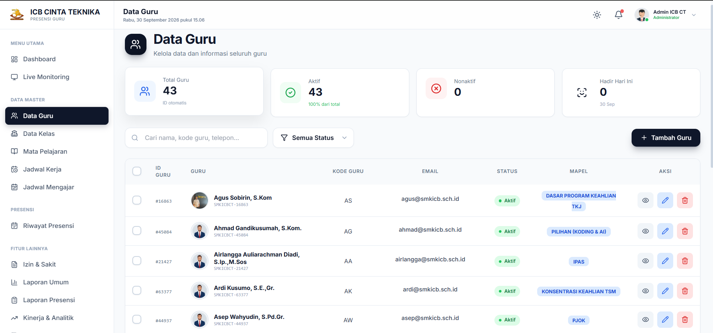
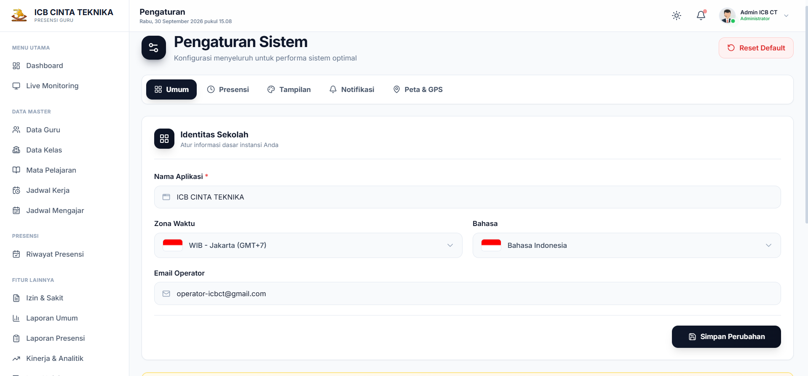

# 📸 Screenshots — ICB CT Presensi Guru

Dokumentasi visual tampilan halaman-halaman utama sistem.

> Semua screenshot diambil dari versi production di [presensi-guru.smkicb-teknika.sch.id](https://presensi-guru.smkicb-teknika.sch.id)

---

## Struktur Folder

```
docs/screenshots/
├── auth/          → Halaman login, lupa password, reset password
├── admin/         → Dashboard admin, live monitoring, log aktivitas, pengaturan
├── guru/          → Dashboard guru, presensi harian, presensi kelas, riwayat, izin
├── piket/         → Dashboard piket, manual presensi, approval izin
└── mobile/        → Tampilan mobile (responsive)
```

---

## 🔐 Auth

| Halaman | Preview |
|---------|---------|
| Login |  |
| Lupa Password |  |
| Reset Password |  |

---

## 🛠️ Admin

| Halaman | Preview |
|---------|---------|
| Dashboard |  |
| Live Monitoring |  |
| Log Aktivitas |  |
| Data Guru |  |
| Laporan |  |
| Pengaturan |  |

---

## 👨‍🏫 Guru

| Halaman | Preview |
|---------|---------|
| Dashboard |  |
| Presensi Harian |  |
| Presensi Kelas |  |
| Riwayat |  |
| Pengajuan Izin |  |
| Jadwal Mengajar |  |
| Profil |  |

---

## 🏫 Piket

| Halaman | Preview |
|---------|---------|
| Dashboard Piket |  |
| Manual Presensi |  |
| Approval Izin |  |

---

## 📱 Mobile

| Halaman | Preview |
|---------|---------|
| Login Mobile |  |
| Dashboard Mobile |  |
| Presensi Mobile |  |

---

## Cara Nambahin Screenshot

1. Ambil screenshot halaman yang mau didokumentasiin
2. Simpan di folder yang sesuai, pakai nama file yang sama persis kayak tabel di atas
3. Format yang disupport: `.png`, `.jpg`, `.webp`
4. Resolusi recommended: **1280×800** buat desktop, **390×844** buat mobile
5. Commit dan push — otomatis keliatan di sini dan di README utama

```bash
git add docs/screenshots/
git commit -m "docs: tambah screenshots halaman X"
git push
```

---

<div align="center">

*Dokumentasi ini bagian dari project [ICB CT — Sistem Presensi Guru](../README.md)*

</div>
